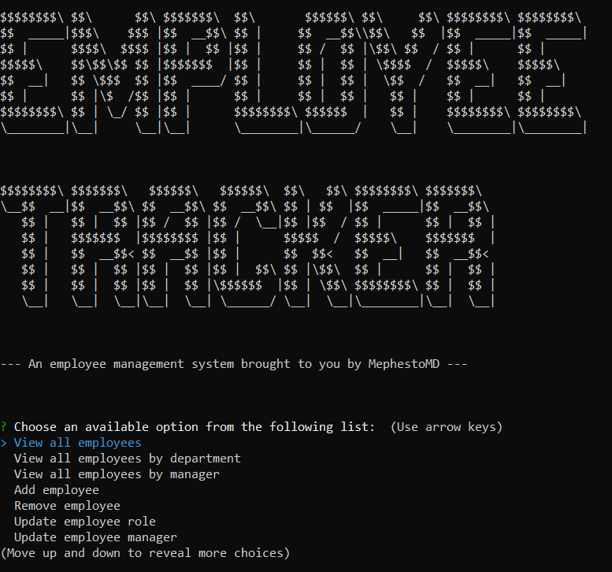

  
  # <a name = "Title">Employee-Tracker</a>
  <a href = "https://drive.google.com/file/d/1aBr0ImVQnViVrDHFwXp7QTZxbspiCLzX/view"> Screencastify Video Demonstration </a>

  
  
  ## <a name = "Description">Description</a>
  
  ### <a name = "subMotivation">Motivation</a>

  To help office managers organize and manage their database of employees in an easily-accessible UI
  
  
  ### <a name = subProblems>Problems</a>

  Being able to store employee information neatly and accessibly is a major solution to employee management
  
  ### <a name = "subLearned">What I learned</a>

  Through this project, a greater understanding of MYSQL commands was attained, especially with respect to JOIN, INSERT, DELETE and SELECT statements.
  
  ## Table of Contents
  
  1. [Title](#Title)
  2. [Description](#Description)
      * [Motivation](#subMotivation)
      * [Build Steps](#subBuild)
      * [Problems](#subProblems)
      * [What I learned](#subLearned)
  3. [Installation](#Installation)
  4. [Usage](#Usage)
  5. [License](#License)
  6. [Contributing](#Contributing)
  7. [Tests](#Tests)
  8. [Questions](#Questions)
  
  ## <a name = "Installation">Installation</a>

  Download the app, type 'npm i' to install dependcies, then type 'npm start' to begin the command-line application.
  
  ## <a name = "Usage">Usage</a>

  After typing 'npm start', you will be presented with a menu of options for adding, removing and updating your employee database, as well as the ability to view employees, roles, departments, and managers

  ## <a name = "Contributing">Contributing</a>

  Please see https://www.contributor-covenant.org/ for contributition guidelines.

  ## <a name = "License">License</a>
<a href = "https://opensource.org/licenses/MIT">The MIT License</a>
  Copyright 2021 cv

    Permission is hereby granted, free of charge, to any person obtaining a copy of this software and associated documentation files (the "Software"), to deal in the Software without restriction, including without limitation the rights to use, copy, modify, merge, publish, distribute, sublicense, and/or sell copies of the Software, and to permit persons to whom the Software is furnished to do so, subject to the following conditions:
    
    The above copyright notice and this permission notice shall be included in all copies or substantial portions of the Software.

    THE SOFTWARE IS PROVIDED "AS IS", WITHOUT WARRANTY OF ANY KIND, EXPRESS OR IMPLIED, INCLUDING BUT NOT LIMITED TO THE WARRANTIES OF MERCHANTABILITY, FITNESS FOR A PARTICULAR PURPOSE AND NONINFRINGEMENT. IN NO EVENT SHALL THE AUTHORS OR COPYRIGHT HOLDERS BE LIABLE FOR ANY CLAIM, DAMAGES OR OTHER LIABILITY, WHETHER IN AN ACTION OF CONTRACT, TORT OR OTHERWISE, ARISING FROM, OUT OF OR IN CONNECTION WITH THE SOFTWARE OR THE USE OR OTHER DEALINGS IN THE SOFTWARE.

  ## <a name = "Questions">Questions</a>

  For questions or comments, please go to:
  <a href = "https://github.com/MephestoMD">MephestoMD's GitHub Profile</a>
  OR
  Contact MephestoMD at:
  [maxson.green@gmail.com](mailto:maxson.green@gmail.com)